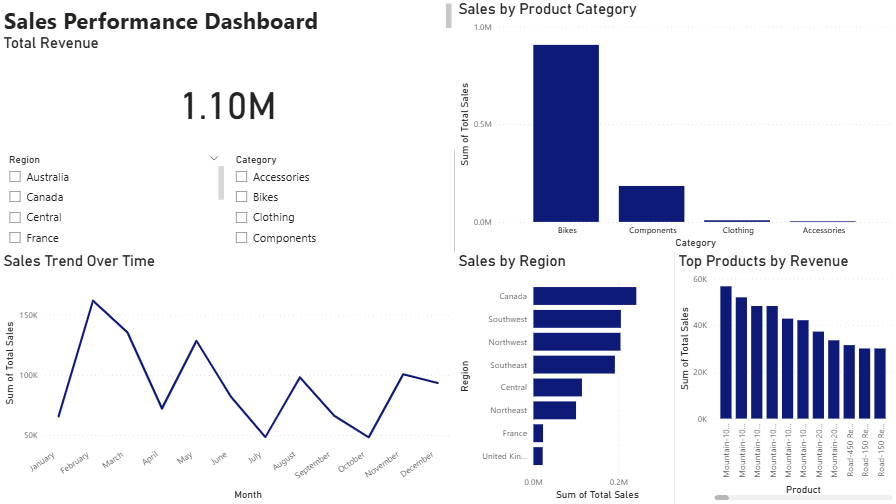

# Sales Performance Dashboard (Power BI)

## Overview
This project analyses sales data using Power BI to identify trends, regional performance, and key revenue drivers. The dashboard was designed to support data-driven decision-making by providing a clear view of sales performance across time, product categories, regions, and top-performing products.

## Dashboard Preview

## Objectives
- Analyse overall sales performance
- Identify revenue trends over time
- Compare sales across product categories
- Evaluate regional performance
- Highlight top-performing products
- Enable interactive filtering for deeper analysis

## Dashboard Features
- **Total Revenue KPI** for a quick snapshot of overall sales performance
- **Sales Trend Over Time** to observe monthly fluctuations and seasonality
- **Sales by Product Category** to identify major revenue drivers
- **Sales by Region** to compare geographic performance
- **Top Products by Revenue** to highlight the strongest-performing products
- **Interactive slicers** for filtering by region and category

## Key Insights
- Bikes dominate revenue, accounting for the vast majority of the 1.10M total — Components are a distant second
- Sales fluctuate throughout the year, suggesting potential seasonality in demand
- Revenue peaks in March then falls sharply through mid-year, recovering slightly in Q4 — this seasonal pattern warrants further investigation
- Canada and Southwest are among the strongest-performing regions
- Mountain bike variants consistently rank as the top products by individual revenue

## Recommendations
- Sustain growth in the Bikes category while reviewing opportunities to improve lower-performing categories
- Investigate why top-performing regions outperform others and apply lessons to weaker markets
- Monitor top-performing products closely, as revenue appears concentrated among a small product set

## Tools Used
- Power BI
- Excel
- Adventure Works dataset

## How to Use
1. Download the `.pbix` file from the dashboard folder
2. Open it in Power BI Desktop
3. Use slicers to explore different regions and categories
4. Analyse the visuals to understand performance trends

## Project Purpose
This project demonstrates my ability to:
- build interactive dashboards in Power BI
- analyse business data and extract insights
- communicate findings clearly
- support data-driven decision making

## Author
**Hadi Nuno Handrison**  
Computer Science Graduate | Master of Management @ USYD  
Interested in technology, analytics, and business-focused roles